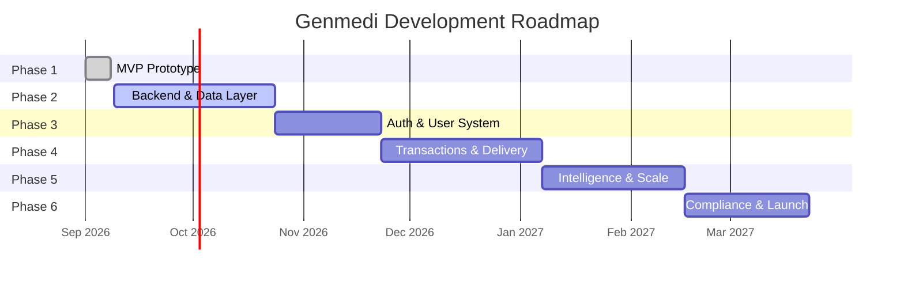
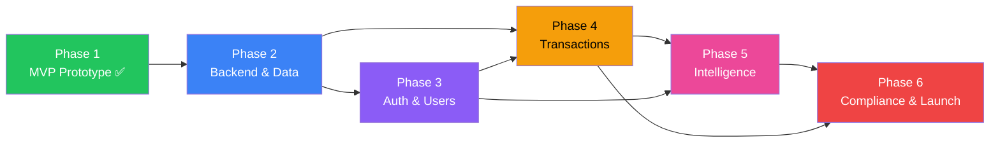

# 🚀 Genmedi — Development Phases

> **Purpose:** Master development roadmap broken into actionable phases with clear milestones, deliverables, dependencies, and acceptance criteria. This file guides the entire project lifecycle from MVP prototype to production launch.

---

## Phase Overview



| Phase | Name                          | Status         | Duration  | Key Outcome                                      |
|-------|-------------------------------|----------------|-----------|--------------------------------------------------|
| 1     | MVP Prototype                 | ✅ Complete     | ~1 week   | Full UI prototype with 12 views, AI, dual shell  |
| 2     | Backend & Data Layer          | 🔲 Next Up     | ~6 weeks  | Real database, APIs, prescription OCR            |
| 3     | Auth & User System            | 🔲 Planned     | ~4 weeks  | Authentication, profiles, health vault           |
| 4     | Transactions & Delivery       | 🔲 Planned     | ~6 weeks  | Payments, real-time tracking, notifications      |
| 5     | Intelligence & Scale          | 🔲 Planned     | ~5 weeks  | Drug interactions, i18n, doctor portal, PWA      |
| 6     | Compliance & Launch           | 🔲 Planned     | ~5 weeks  | Security audit, regulatory, performance, launch  |

---

## Phase 1: MVP Prototype ✅

> **Goal:** Build a complete, demo-ready prototype showcasing the full Genmedi user journey with mock data and AI integration.

**Status:** Complete as of 2026-09-08

### Deliverables

- [x] **12 Feature Views** — Discover, Rx Vault, Checkout, Live Tracking, AI Pharmacist, Health Vault, Clinical Reviewer, Admin Ops, Bioequivalence Studio, Exception Resolution, Pharmacy Hub, Architecture.
- [x] **Dual UI Shell** — Desktop website (sidebar + header + footer) and mobile/tablet app (bottom nav + compact header).
- [x] **Device Mode Switcher** — Auto-detection with manual override (auto / desktop / phone).
- [x] **AI Clinical Pharmacist** — Gemini 3.8 Flash integration with clinical fallback.
- [x] **Backend API** — Express.js with health check, pharmacist query, and Rx OCR endpoints.
- [x] **Typed Data Layer** — 9 TypeScript interfaces, 8 medicines, 3 hubs, sample prescriptions, order tracking, and exceptions.
- [x] **Design System** — IBM Plex Sans + JetBrains Mono, curated color palette, Lucide icons, Framer Motion animations.
- [x] **Project Documentation** — `decisions.md`, `rules.md`, `memory.md`, `changelog.md`.

### Key Files Produced

| File | Purpose |
|------|---------|
| [`server.ts`](file:///d:/Projects/Genmedi/server.ts) | Express backend with 3 API routes |
| [`src/App.tsx`](file:///d:/Projects/Genmedi/src/App.tsx) | Root component with state management |
| [`src/types.ts`](file:///d:/Projects/Genmedi/src/types.ts) | 9 TypeScript interfaces |
| [`src/data/mockData.ts`](file:///d:/Projects/Genmedi/src/data/mockData.ts) | All mock/seed data |
| 15 component files | Feature views + layout shells |

### Phase 1 Exit Criteria ✅

- [x] All 12 views render without errors in both desktop and mobile shells.
- [x] `tsc --noEmit` passes.
- [x] Dev server starts with `npm run dev`.
- [x] AI Pharmacist works with and without `GEMINI_API_KEY`.
- [x] Toast notifications function globally.
- [x] Error boundary catches rendering failures.

---

## Phase 2: Backend & Data Layer 🔲

> **Goal:** Replace the mock data layer with a production database, build proper REST APIs, and integrate real prescription OCR.

### 2.1 — Database Setup

- [ ] **Choose database** — PostgreSQL (recommended for relational medicine/prescription data) or MongoDB (if document flexibility is preferred).
- [ ] **Design database schema** based on existing TypeScript interfaces in `src/types.ts`:

  | Table / Collection       | Based On              | Key Fields                                       |
  |--------------------------|-----------------------|--------------------------------------------------|
  | `medicines`              | `Medicine`            | id, brand_name, generic_name, bio_index, prices  |
  | `stockist_hubs`          | `StockistHub`         | id, name, address, coordinates, delivery_mins    |
  | `prescriptions`          | `Prescription`        | id, doctor_id, patient_id, status, items (JSON)  |
  | `prescription_items`     | `PrescriptionItem`    | id, rx_id, molecule, brand_price, generic_price  |
  | `orders`                 | `OrderTracking`       | id, user_id, rx_id, status, rider_id, eta        |
  | `cart_items`             | `CartItem`            | id, user_id, medicine_id, quantity, is_generic    |
  | `exceptions`             | `PriorityException`   | id, order_id, hub_id, type, severity, sla_mins   |
  | `dissolution_data`       | `DissolutionCurveData`| medicine_id, time_minutes, innovator, generic     |

- [ ] **Set up ORM** — Prisma (recommended) or Drizzle for type-safe database queries.
- [ ] **Write migration scripts** for initial schema creation.
- [ ] **Seed database** with current mock data from `mockData.ts`.

### 2.2 — REST API Layer

- [ ] **Refactor `server.ts`** — Extract routes into modular files:

  ```
  server/
  ├── index.ts              # Express app setup + Vite middleware
  ├── routes/
  │   ├── health.ts         # GET /api/health
  │   ├── medicines.ts      # CRUD /api/medicines
  │   ├── prescriptions.ts  # CRUD /api/prescriptions
  │   ├── orders.ts         # CRUD /api/orders
  │   ├── hubs.ts           # GET /api/hubs
  │   ├── pharmacist.ts     # POST /api/pharmacist/query
  │   └── ocr.ts            # POST /api/ocr/parse
  ├── middleware/
  │   ├── errorHandler.ts   # Global error handling
  │   ├── validation.ts     # Request body validation (Zod)
  │   └── rateLimiter.ts    # API rate limiting
  └── db/
      ├── client.ts         # Database connection
      ├── schema.ts         # Prisma/Drizzle schema
      └── seed.ts           # Database seeding script
  ```

- [ ] **Build new API endpoints:**

  | Method   | Route                          | Description                           |
  |----------|--------------------------------|---------------------------------------|
  | `GET`    | `/api/medicines`               | List all medicines (with search/filter) |
  | `GET`    | `/api/medicines/:id`           | Get medicine by ID                    |
  | `GET`    | `/api/hubs`                    | List stockist hubs (sorted by distance) |
  | `GET`    | `/api/hubs/:id`                | Get hub details                       |
  | `POST`   | `/api/prescriptions`           | Create new prescription               |
  | `GET`    | `/api/prescriptions/:id`       | Get prescription details              |
  | `PATCH`  | `/api/prescriptions/:id`       | Update prescription status            |
  | `POST`   | `/api/orders`                  | Place a new order                     |
  | `GET`    | `/api/orders/:id`              | Get order with tracking               |
  | `PATCH`  | `/api/orders/:id/status`       | Update order status                   |
  | `GET`    | `/api/exceptions`              | List active exceptions                |
  | `PATCH`  | `/api/exceptions/:id/resolve`  | Resolve an exception                  |

- [ ] **Add request validation** using Zod schemas for all POST/PATCH bodies.
- [ ] **Add error handling middleware** for consistent error responses.

### 2.3 — Prescription OCR Integration

- [ ] **Integrate Google Cloud Vision API** for real image-to-text extraction.
- [ ] **Build OCR parsing pipeline:**
  1. Image upload → Cloud Vision → raw text extraction.
  2. Raw text → Gemini AI → structured JSON (doctor, patient, medications).
  3. Structured JSON → database lookup → generic substitution mapping.
- [ ] **Support formats:** Camera capture, image upload (JPG/PNG), PDF scan.
- [ ] **Add OCR confidence scoring** for each extracted field.

### 2.4 — Frontend Migration

- [ ] **Replace mock imports** with `fetch()` / API calls in all components.
- [ ] **Create API service layer** (`src/services/api.ts`) with typed request/response helpers.
- [ ] **Add loading states** (skeleton loaders) for all data-fetching views.
- [ ] **Add error states** for failed API calls with retry buttons.
- [ ] **Implement search** — real full-text search against `/api/medicines` with debouncing.

### Phase 2 Exit Criteria

- [ ] All 12 views render with data from the database (no mock imports remain in components).
- [ ] All API endpoints return correct responses with validation.
- [ ] OCR parses at least 3 sample prescription images correctly (>80% field accuracy).
- [ ] Database can be seeded and reset cleanly.
- [ ] `decisions.md` updated with database and API architecture decisions.

---

## Phase 3: Auth & User System 🔲

> **Goal:** Implement user authentication, role-based access, patient profiles, and persistent health records.

### 3.1 — Authentication

- [ ] **Choose auth strategy** — JWT (stateless) or session-based (server-managed).
- [ ] **Implement auth endpoints:**

  | Method | Route                  | Description                    |
  |--------|------------------------|--------------------------------|
  | `POST` | `/api/auth/register`   | Create new user account        |
  | `POST` | `/api/auth/login`      | Authenticate and return token  |
  | `POST` | `/api/auth/logout`     | Invalidate session/token       |
  | `POST` | `/api/auth/refresh`    | Refresh expired token          |
  | `GET`  | `/api/auth/me`         | Get current user profile       |

- [ ] **Add auth middleware** to protect API routes.
- [ ] **Build login/register UI** — clean modal or dedicated page.
- [ ] **Implement OTP verification** for phone number (Indian mobile +91).

### 3.2 — Role-Based Access

- [ ] **Define roles:**

  | Role          | Access Level                                          |
  |---------------|-------------------------------------------------------|
  | `patient`     | Discover, Rx Vault, Checkout, Tracking, AI Pharmacist, Health Vault |
  | `pharmacist`  | All patient views + Clinical Reviewer, Bioequivalence Studio |
  | `admin`       | All views + Admin Ops, Exception Resolution, Pharmacy Hub |
  | `rider`       | Order pickup, delivery, OTP verification              |

- [ ] **Implement route guards** — redirect unauthorized users.
- [ ] **Show/hide navigation tabs** based on user role.
- [ ] **Add role-specific dashboard** as landing page per role.

### 3.3 — Patient Profile & Health Vault

- [ ] **User profile** — name, age, gender, ABHA ID, contact, address book.
- [ ] **Allergy profile** — documented allergies with severity levels.
- [ ] **Medication history** — past prescriptions, dispensation records.
- [ ] **Health records** — lab reports, vitals, chronic condition tracking.
- [ ] **Address management** — saved delivery addresses with default selection.

### 3.4 — Pharmacist Portal

- [ ] **Pharmacist verification** — registration number, license upload, CDSCO validation.
- [ ] **Queue management** — pending prescriptions assigned for review.
- [ ] **Digital signature** — cryptographic sign-off with timestamp and hash.

### Phase 3 Exit Criteria

- [ ] Users can register, login, and logout.
- [ ] Role-based access controls are enforced on all routes and API endpoints.
- [ ] Patient profile persists across sessions.
- [ ] Allergy profile triggers appropriate warnings during checkout.
- [ ] Pharmacist can review and sign prescriptions through the Clinical Reviewer view.

---

## Phase 4: Transactions & Delivery 🔲

> **Goal:** Enable real payments, real-time delivery tracking, push notifications, and operational delivery management.

### 4.1 — Payment Integration

- [ ] **Integrate Razorpay** (primary, India-focused) with UPI, cards, net banking, and wallets.
- [ ] **Build payment flow:**
  1. Cart review → Checkout → Razorpay order creation (server-side).
  2. Razorpay checkout modal → payment capture → webhook confirmation.
  3. Order confirmation → Rx verification queue → dispatch.
- [ ] **Implement pricing engine:**
  - Subtotal calculation (brand vs. generic per item).
  - Delivery fee (free for orders above ₹X, ₹Y for fast delivery).
  - GST calculation (as applicable).
  - Coupon/promo code support.
- [ ] **Payment receipts** — PDF generation with GST invoice format.
- [ ] **Refund handling** — full/partial refund for failed deliveries or cancellations.

### 4.2 — Real-Time Delivery Tracking

- [ ] **WebSocket server** — integrate Socket.io or native WebSocket for live updates.
- [ ] **Rider app integration:**
  - GPS location streaming (rider → server → customer).
  - Order status transitions (picked → in-transit → arrived → delivered).
  - OTP verification at handover.
- [ ] **Map integration** — Mapbox or Google Maps embed for visual tracking.
- [ ] **Cold chain monitoring** — IoT sensor data (temperature, humidity) streamed to order dashboard.
- [ ] **ETA calculation** — real-time ETA based on rider GPS, traffic, and distance.

### 4.3 — Push Notifications

- [ ] **Firebase Cloud Messaging (FCM)** integration for web push.
- [ ] **Notification triggers:**

  | Event                        | Recipient     | Message                                    |
  |------------------------------|---------------|--------------------------------------------|
  | Rx submitted                 | Pharmacist    | "New prescription pending review"          |
  | Rx verified                  | Patient       | "Your prescription has been verified"      |
  | Order dispatched             | Patient       | "Your order is on the way (ETA: X mins)"  |
  | Rider arrived                | Patient       | "Rider has arrived — share OTP XXXX"      |
  | Delivered                    | Patient       | "Order delivered successfully"             |
  | Exception raised             | Admin         | "Critical: Cold chain breach on GM-XXXXX" |
  | SLA at risk                  | Admin + Rider | "SLA breach in X mins — action required"  |

- [ ] **In-app notification center** — bell icon with unread count and notification list.
- [ ] **SMS fallback** — for critical notifications (OTP, delivery arrival).

### 4.4 — Rider Management

- [ ] **Rider assignment algorithm** — nearest available rider with capacity and EV range check.
- [ ] **Rider dashboard** — active orders, navigation, earnings, delivery history.
- [ ] **Fleet management** — admin view for rider location, availability, and performance metrics.

### 4.5 — Order Lifecycle

- [ ] **Order state machine:**

  ```
  cart → payment_pending → paid → rx_review → rx_verified → 
  hub_assigned → dispensing → sealed → rider_assigned → 
  picked_up → in_transit → arrived → otp_verified → delivered
  ```

- [ ] **Cancellation policy** — time-window-based cancellation with refund rules.
- [ ] **Re-order** — one-tap re-order from order history.

### Phase 4 Exit Criteria

- [ ] End-to-end payment works (cart → pay → order confirmation).
- [ ] Real-time tracking shows rider location on map with live ETA.
- [ ] Push notifications fire for all major order events.
- [ ] Admin can view all active deliveries and intervene on exceptions.
- [ ] Cold chain data is visible in the tracking view.

---

## Phase 5: Intelligence & Scale 🔲

> **Goal:** Add clinical intelligence, multi-language support, doctor portal, and progressive web app capabilities.

### 5.1 — Drug-Drug Interaction Engine

- [ ] **Build interaction database** — map known drug interactions with severity levels.
- [ ] **Cross-prescription checking** — alert when a new Rx conflicts with active medications.
- [ ] **Severity levels:**

  | Level          | Action                                            |
  |----------------|---------------------------------------------------|
  | `critical`     | Block substitution, require doctor override       |
  | `major`        | Warn pharmacist, require manual approval          |
  | `moderate`     | Display warning to patient, allow proceed         |
  | `minor`        | Informational note only                           |

- [ ] **Integrate with AI Pharmacist** — Gemini-powered interaction analysis with citation.

### 5.2 — Multi-Language Support (i18n)

- [ ] **Set up i18n framework** — `react-i18next` or similar.
- [ ] **Priority languages:**

  | Language   | Code  | Priority | Coverage Target |
  |------------|-------|----------|-----------------|
  | English    | `en`  | P0       | 100% (default)  |
  | Hindi      | `hi`  | P1       | 100%            |
  | Kannada    | `kn`  | P1       | 90%             |
  | Tamil      | `ta`  | P2       | 90%             |
  | Telugu     | `te`  | P2       | 80%             |
  | Marathi    | `mr`  | P3       | 80%             |

- [ ] **Language selector** in header/settings.
- [ ] **RTL support** — if Urdu/Arabic are added in future.
- [ ] **Medical term consistency** — maintain a glossary for translated clinical terms.

### 5.3 — Doctor E-Prescribing Portal

- [ ] **Doctor registration** — license verification with Medical Council of India (MCI) database.
- [ ] **E-prescribing interface:**
  - Patient search / create.
  - Diagnosis entry with ICD-10 codes.
  - Medicine selection with auto-suggest (brand → generic mapping).
  - Dosage, frequency, duration builder.
  - Digital signature and submission.
- [ ] **Direct Rx-to-pharmacy flow** — prescription goes directly to patient's preferred pharmacy hub.

### 5.4 — Progressive Web App (PWA)

- [ ] **Service worker** — offline support for medicine browsing and order history.
- [ ] **Install prompt** — "Add to Home Screen" for mobile users.
- [ ] **Cache strategy:**
  - Medicine catalog → cache-first with background refresh.
  - Order tracking → network-first with offline fallback.
  - Static assets → cache-first.
- [ ] **App manifest** — icons, theme color, splash screen.

### 5.5 — Analytics & Reporting

- [ ] **Admin analytics dashboard:**
  - Daily/weekly/monthly orders, revenue, savings delivered.
  - Delivery SLA compliance rate.
  - Hub utilization and stock levels.
  - Top prescribed medicines and generic adoption rate.
- [ ] **Conversion funnel** — Discover → Cart → Checkout → Payment → Delivery tracking.
- [ ] **Patient analytics** — medication adherence tracking, refill reminders.

### Phase 5 Exit Criteria

- [ ] Drug interaction warnings appear during checkout and Rx review.
- [ ] App works in Hindi and at least one regional language.
- [ ] Doctor can create and submit an e-prescription end-to-end.
- [ ] PWA installs on mobile and works offline for key features.
- [ ] Admin dashboard shows real-time analytics.

---

## Phase 6: Compliance & Launch 🔲

> **Goal:** Ensure regulatory compliance, security hardening, performance optimization, and public launch readiness.

### 6.1 — Regulatory Compliance

- [ ] **Indian health data regulations:**
  - Digital Information Security in Healthcare Act (DISHA) compliance assessment.
  - Information Technology Act, 2000 — data protection provisions.
  - Personal Data Protection Bill compliance.
- [ ] **CDSCO regulatory requirements:**
  - E-pharmacy license application (if applicable per state).
  - Schedule H / H1 drug dispensation compliance.
  - Pharmacist-on-record requirement validation.
- [ ] **ABHA integration** — Ayushman Bharat Digital Mission API for patient ID verification.
- [ ] **Data residency** — ensure all patient data is stored in India (AWS Mumbai / GCP Mumbai).

### 6.2 — Security Hardening

- [ ] **Security audit:**
  - [ ] OWASP Top 10 vulnerability assessment.
  - [ ] SQL injection / NoSQL injection testing.
  - [ ] XSS prevention audit (React default + CSP headers).
  - [ ] CSRF protection on all state-changing endpoints.
  - [ ] Rate limiting on auth and AI endpoints.
- [ ] **Penetration testing** — engage third-party security firm.
- [ ] **Data encryption:**
  - At rest — database encryption (AES-256).
  - In transit — TLS 1.3 for all connections.
  - Patient health data — field-level encryption for sensitive fields.
- [ ] **Audit logging** — log all prescription access, modifications, and pharmacist sign-offs.
- [ ] **RBAC enforcement audit** — verify no privilege escalation paths exist.

### 6.3 — Performance Optimization

- [ ] **Frontend:**
  - Code splitting — lazy load view components.
  - Image optimization — WebP with fallback, lazy loading.
  - Bundle analysis — identify and eliminate dead code.
  - Target: Lighthouse score ≥ 90 (Performance, Accessibility, Best Practices, SEO).
- [ ] **Backend:**
  - Database query optimization — indexes, query plans.
  - API response caching — Redis for frequently accessed data (medicine catalog).
  - Connection pooling for database.
  - Target: API p95 latency < 200ms.
- [ ] **CDN setup** — CloudFront / Cloud CDN for static assets and API edge caching.
- [ ] **Load testing** — simulate 1000 concurrent users with k6 or Artillery.

### 6.4 — Deployment & Infrastructure

- [ ] **CI/CD pipeline:**
  - GitHub Actions for lint, type-check, build, test.
  - Staging deployment on PR merge.
  - Production deployment on release tag.
- [ ] **Infrastructure:**
  - Containerize with Docker (multi-stage build).
  - Deploy on AWS ECS / GCP Cloud Run.
  - Database on RDS / Cloud SQL (managed PostgreSQL).
  - Redis for caching and session store.
- [ ] **Monitoring:**
  - Application monitoring — Sentry for error tracking.
  - Infrastructure monitoring — CloudWatch / GCP Monitoring.
  - Uptime monitoring — Pingdom or UptimeRobot.
  - Alerting — PagerDuty or Slack webhooks for critical issues.

### 6.5 — Pre-Launch Checklist

- [ ] **Legal:**
  - Terms of Service drafted and reviewed.
  - Privacy Policy compliant with Indian data protection laws.
  - Refund and cancellation policy published.
  - Disclaimer: "Not a substitute for professional medical advice."
- [ ] **Operational:**
  - Customer support channel (WhatsApp / email / in-app chat).
  - Pharmacist on-call rotation schedule.
  - Hub partner onboarding complete (minimum 3 hubs in launch city).
  - Rider fleet onboarded (minimum 10 riders in launch city).
- [ ] **Marketing:**
  - Landing page with waitlist.
  - App Store / Play Store listing (if native wrapper).
  - Launch city: Bengaluru (existing hub/stockist data).
- [ ] **Go-Live:**
  - Staging → Production promotion.
  - DNS configuration for production domain.
  - SSL certificate provisioning.
  - Smoke test all critical flows on production.
  - Rollback plan documented and tested.

### Phase 6 Exit Criteria

- [ ] Security audit report with zero critical/high findings.
- [ ] Regulatory compliance checklist fully addressed.
- [ ] Lighthouse scores ≥ 90 across all categories.
- [ ] Load test passes at 1000 concurrent users.
- [ ] CI/CD pipeline deploys to staging and production.
- [ ] All legal documents published.
- [ ] **🎉 Public beta launch in Bengaluru.**

---

## Cross-Phase Dependencies



> **Note:** Phase 3 (Auth) and Phase 4 (Transactions) can be partially parallelized — payment integration can begin while auth is being finalized, since Razorpay has its own user identification layer.

---

## Risk Register

| Risk                                    | Phase | Probability | Impact   | Mitigation                                      |
|-----------------------------------------|-------|-------------|----------|--------------------------------------------------|
| Gemini API rate limits during high traffic | 2, 4 | Medium      | High     | Clinical fallback engine already built; add Redis caching for repeated queries |
| CDSCO e-pharmacy license delays         | 6     | High        | Critical | Begin regulatory filing in Phase 4; consult pharma legal counsel early |
| Cold chain sensor hardware integration  | 4     | Medium      | Medium   | Start with simulated data; partner with IoT vendor for pilot |
| OCR accuracy on handwritten prescriptions | 2   | High        | High     | Combine Vision API + Gemini for multi-pass extraction; manual fallback queue |
| Payment gateway integration complexity  | 4     | Low         | High     | Use Razorpay's well-documented React SDK; test on sandbox extensively |
| Multi-language medical term accuracy    | 5     | Medium      | Medium   | Hire medical translators; maintain reviewed glossary per language |
| Data breach / patient data leak         | 3–6   | Low         | Critical | Field-level encryption, SOC 2 compliance, penetration testing |

---

*Last updated: 2026-09-08*
